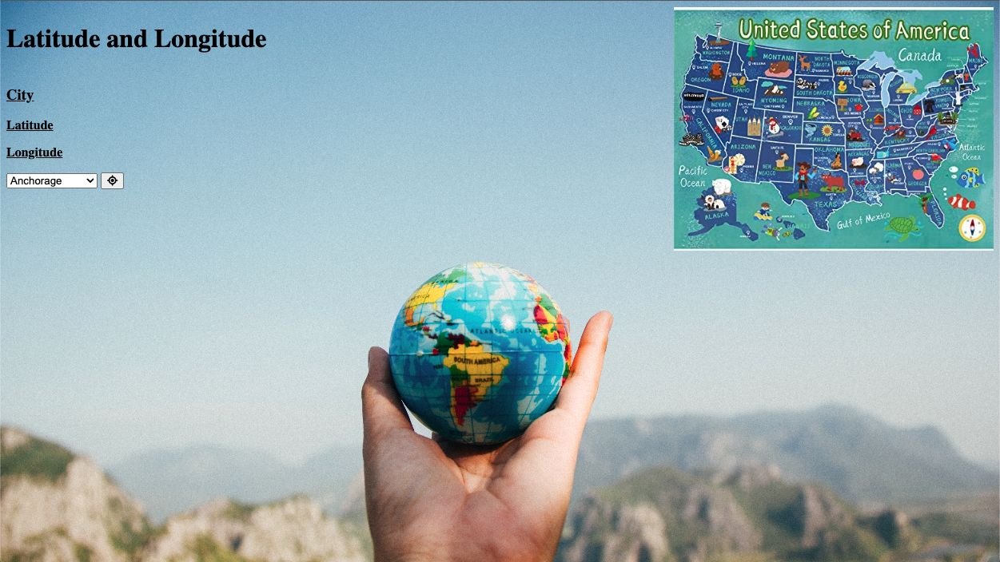

# Latitude and Longitude

A web application to retrieve coordinates of some major US cities.

## Technologies Used

- HTML
- CSS
- FLexbox
- JavaScript
- jQuery
- Airlabs API

## Screenshots

## Getting Started

[Enough reading, take a look!](https://mellow-choux-7e5976.netlify.app/)

## Future Enhancements

- Add animations
- Add more cities
- Ability to find nearest POI's